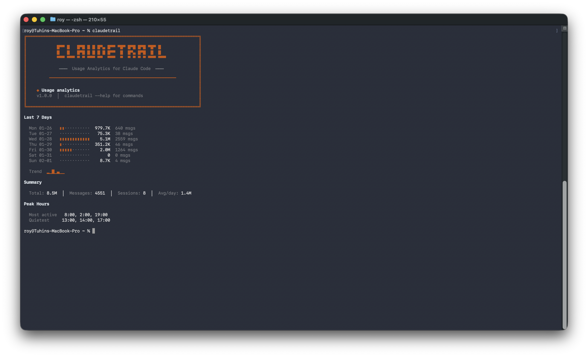

# Claudetrail

```
╔════════════════════════════════════════════════════════════════════╗
║                                                                    ║
║            █▀▀ █   █▀█ █ █ █▀▄ █▀▀ ▀█▀ █▀█ █▀█ ▀█▀ █               ║
║            █   █   █▀█ █ █ █ █ █▀▀  █  █▀▄ █▀█  █  █               ║
║            ▀▀▀ ▀▀▀ ▀ ▀ ▀▀▀ ▀▀  ▀▀▀  ▀  ▀ ▀ ▀ ▀ ▀▀▀ ▀▀▀             ║
║                                                                    ║
║             ━━━  Usage Analytics for Claude Code  ━━━              ║
║                                                                    ║
╚════════════════════════════════════════════════════════════════════╝
```

**Usage analytics and alerts for Claude Code Pro** - Track your session and weekly usage patterns with beautiful terminal visualizations.



## Why Claudetrail?

Claude Code Pro users face a common problem: **no visibility into usage patterns**. The built-in `/usage` command shows current percentages, but doesn't tell you:

- How your usage varies day-to-day
- Which projects consume the most quota
- Your peak usage hours
- Whether you're on track for the week

Claudetrail fills this gap by analyzing Claude Code's local data files to provide rich analytics that complement the built-in `/usage` command.

## Features

| Command | Description |
|---------|-------------|
| `claudetrail` | 7-day usage trends with sparkline visualization |
| `claudetrail history --projects` | Per-project usage breakdown |
| `claudetrail history --sessions` | Session history with efficiency scores |
| `claudetrail week` | Weekly breakdown with daily chart and forecast |
| `claudetrail watch` | Live monitoring with system alerts |
| `claudetrail calibrate` | One-time calibration from `/usage` percentages |
| `claudetrail config` | Configuration management |

## Installation

```bash
# Clone the repository
git clone https://github.com/Troy96/claudetrail.git
cd claudetrail

# Install dependencies
npm install

# Build
npm run build

# Link globally
npm link
```

## Quick Start

### 1. Calibrate (one-time setup)

Run `/usage` in Claude Code to see your current percentages, then:

```bash
claudetrail calibrate -s 59 -w 29 -r wed
```

Where:
- `-s 59` = Session is at 59%
- `-w 29` = Weekly is at 29%
- `-r wed` = Week resets on Wednesday

### 2. View Analytics

```bash
# Default: 7-day usage trends
claudetrail

# Weekly overview with forecast
claudetrail week

# Per-project breakdown
claudetrail history --projects

# Session history
claudetrail history --sessions
```

### 3. Live Monitoring (optional)

```bash
# Foreground with live updates
claudetrail watch

# Background daemon (alerts only)
claudetrail watch --daemon
```

## Sample Output

```
Last 7 Days

  Sat 01-24            ▮▮··········  924.0K  537 msgs
  Sun 01-25            ▮▮▮▮········    1.8M  1816 msgs
  Mon 01-26            ▮▮··········    1.0M  640 msgs
  Tue 01-27            ············   75.3K  38 msgs
  Wed 01-28            ▮▮▮▮▮▮▮▮▮▮▮▮    5.4M  2559 msgs
  Thu 01-29            ▮···········  375.6K  46 msgs
  Fri 01-30            ············  116.7K  19 msgs

  Trend  ▂▃▂▁█▁▁

Summary

  Total: 9.7M  │  Messages: 5655  │  Sessions: 13  │  Avg/day: 1.4M

Peak Hours

  Most active   8:00, 0:00, 9:00
  Quietest     13:00, 14:00, 17:00
```

## Technical Challenges

### No API Access for Individual Users

The biggest challenge was discovering that **Anthropic's Usage & Cost API and Claude Code Analytics API are only available for organization accounts**, not individual Pro/Max subscribers.

From the [official docs](https://docs.anthropic.com/en/docs/build-with-claude/track-usage):
> "The Admin API is unavailable for individual accounts."

This meant we couldn't get real-time quota data programmatically. The workaround was implementing a **calibration system** where users manually input their current percentages from the `/usage` command, and the tool back-calculates the token limits.

### Session Detection

Claude Code's `history.jsonl` doesn't have consistent session boundaries. Messages can have different `sessionId` values even within what feels like one continuous session.

**Solution**: Implemented time-based session grouping - any gap of 2+ hours between messages is considered a new session.

### Token Estimation

The local files don't store actual token counts consumed against the quota. We only have:
- Message content length
- Cache creation tokens (from `stats-cache.json`)

**Solution**: Developed a multiplier-based estimation system. User input tokens are multiplied by ~300x to account for the full context (files, history, system prompts) that Claude Code sends with each request.

### Data Sources

Claudetrail reads from these Claude Code local files:
- `~/.claude/history.jsonl` - Message history with timestamps
- `~/.claude/stats-cache.json` - Aggregated daily stats and token counts
- `~/.claude/projects/*/sessions-index.json` - Session metadata

## Configuration

Config is stored at `~/.claudetrail/config.json`:

```bash
# View current config
claudetrail config

# Set plan type
claudetrail config --plan pro

# Set custom limits
claudetrail config --set limits.tokensPerWeek=50000000

# Reset to defaults
claudetrail config --reset
```

## Future Improvements

- [ ] **Auto-calibration**: Detect quota resets automatically by monitoring usage patterns
- [ ] **Export to CSV/JSON**: Export analytics data for external analysis
- [ ] **Custom alerts**: Configure threshold-based notifications (e.g., "alert at 80%")
- [ ] **Multi-account support**: Track usage across multiple Claude accounts
- [ ] **Web dashboard**: Optional browser-based visualization
- [ ] **API integration**: If Anthropic opens up the Usage API to individual users
- [ ] **Historical comparisons**: Week-over-week and month-over-month trends
- [ ] **Cost estimation**: Estimate dollar value of usage based on API pricing equivalents

## Tech Stack

- **TypeScript** - Type-safe development
- **Commander.js** - CLI framework
- **Chalk** - Terminal styling
- **Chokidar** - File watching for live mode
- **Ora** - Terminal spinners
- **node-notifier** - System notifications

## Requirements

- Node.js >= 18.0.0
- Claude Code Pro or Max subscription
- macOS, Linux, or Windows

## Author

**Tuhin Roy** ([@Troy96](https://github.com/Troy96))

## License

MIT

---

*Claudetrail is not affiliated with Anthropic. It's an independent tool that reads locally-stored Claude Code data.*
